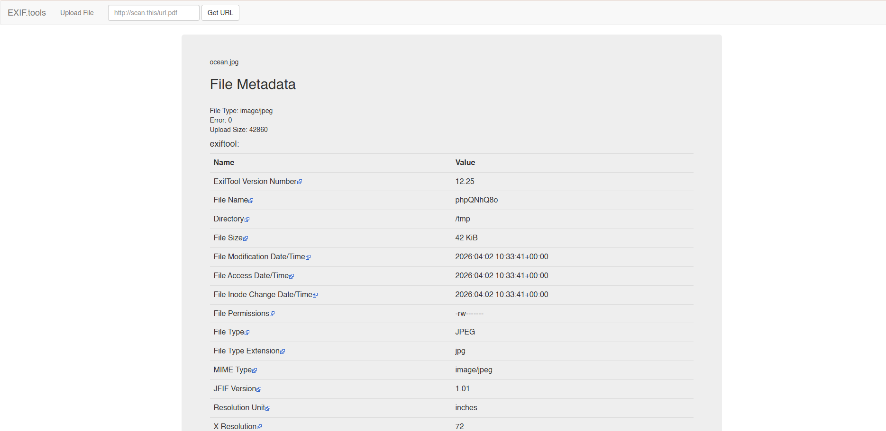
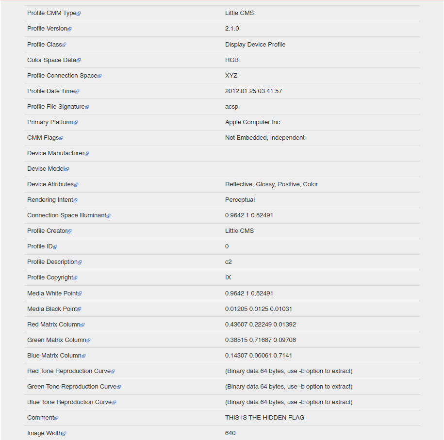
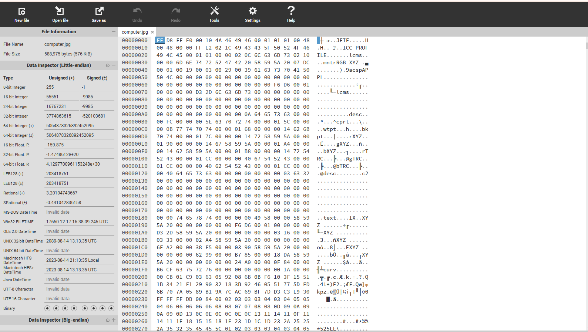
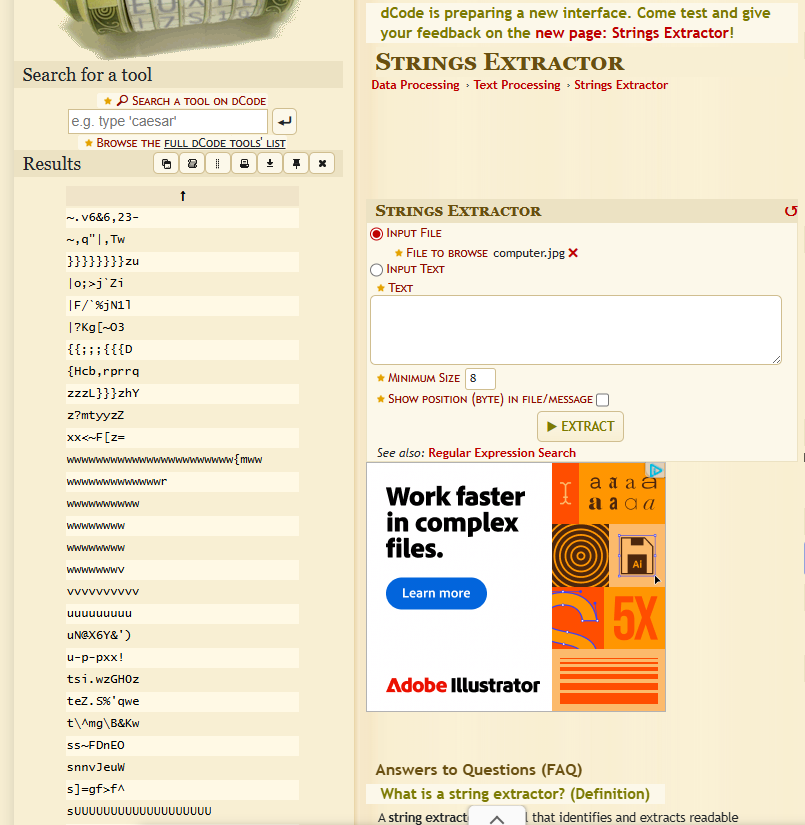

# Reverse-Images
Reverse image search allows users (or attackers, in ethical hacking contexts) to upload or input an image into a search engine to locate:

- The original source of the image 
- Websites where the image appears 
- Visually similar images 
- Metadata or contextual details (date, location, person, or object recognition)
  
# Images 1: Ocean.jpg

Result of The Photo using EXIF.tools:

# Images 2: computer.jpg

Result of The Photo using Hexeditor and String Extractor:

HEXEDITOR:

STRING EXCTRACTOR:

# Images 3: dog.jpg

# Images 4: solitaire.jpg

# Images 5: rubiks.jpg

